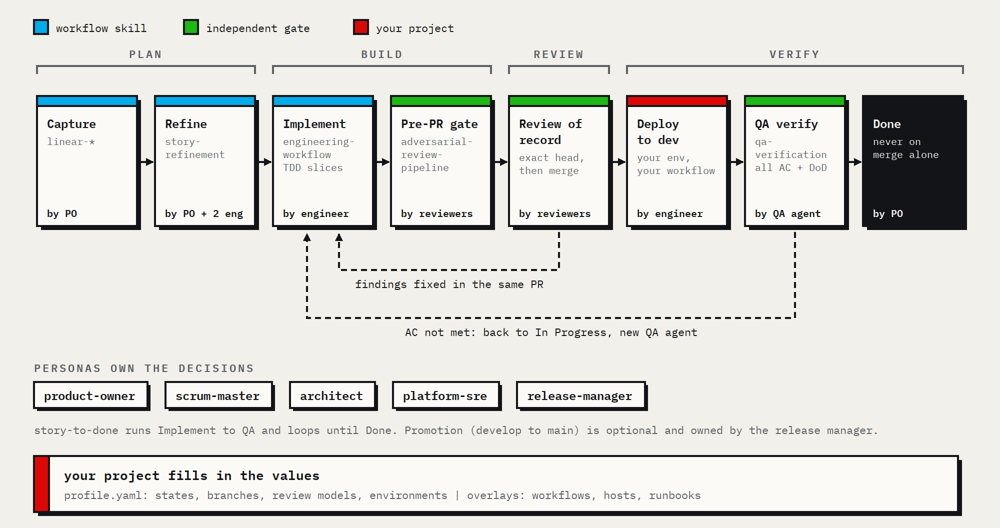

<picture>
  <source media="(prefers-color-scheme: dark)" srcset="marketing/icon/agent-skills-128-dark.png">
  
</picture>

# agent-skills

Base skills for coding agents: an engineering process (story lifecycle, TDD, review of record, deploy verification) packaged as [Agent Skills](https://agentskills.io/specification).
They carry process only.
Each project supplies its own values through a profile and its own operational detail through overlays.

The skills are runtime-neutral; CI checks that OpenCode V2, at the version in `.opencode-version` at the root of the agent-skills repository, discovers every one, and they load the same way in Claude Code.
OpenCode V2 guidance targets the version in `.opencode-version` at the root of the agent-skills repository, from the `@opencode/cli` npm package; OpenCode V1 guidance is legacy, untested.
The discovery check does not claim end-to-end verification of delegated workflows, configured review models, or deployment tooling.

## Workflow

<picture>
  <source media="(prefers-color-scheme: dark)" srcset="marketing/workflow/workflow-dark.png">
  
</picture>

Every story passes the same gates: a pre-PR adversarial check, an independent review of record on the exact head, then QA against the acceptance criteria on a deployed environment.
Done is never "merged".

## Skills

| Skill | Use it to |
|---|---|
| [`engineering-workflow`](skills/engineering-workflow/SKILL.md) | Implement a story end to end: triage, TDD slices, pre-PR gate, PR, review of record, merge, deploy, verify. |
| [`adversarial-review-pipeline`](skills/adversarial-review-pipeline/SKILL.md) | Pre-PR adversarial gate: preflight, sweep, empirical hunt, one arbitration pass, fix and re-verify. |
| [`qa-verification`](skills/qa-verification/SKILL.md) | Verify a deployed story against its acceptance criteria and decide Done, back to In Progress, or Blocked. |
| [`cleanup`](skills/cleanup/SKILL.md) | Clear a story's artifacts - worktrees, branches, QA and scratch debris - and move its hosted evidence onto the story, under a guarded inventory. |
| [`story-refinement`](skills/story-refinement/SKILL.md) | Run independent refinement and secret pointing with the SM/EM facilitating, three engineers voting, and the product owner authoring every tracker write; an optional `metrics` switch (default `off`) reports a run summary in the closing message and posts it on the story. |
| [`persona-product-owner`](skills/persona-product-owner/SKILL.md) | Own the backlog and story lifecycle: triage, refinement, estimation, status, closure. |
| [`persona-scrum-master`](skills/persona-scrum-master/SKILL.md) | Run sprint planning, the async standup, the sprint review, the retrospective, and the DoR/DoD gate, and report velocity and burnup as a report-only scrum master or engineering manager. |
| [`persona-release-manager`](skills/persona-release-manager/SKILL.md) | Own release readiness, the promotion PR's review of record, production verification coordination, and the hand-offs, while deploy, rollback, evidence, and status stay with the skills that own them. |
| [`persona-architect`](skills/persona-architect/SKILL.md) | Write, supersede, and trace decision records, and review design work against the records and engineering practice. |
| [`persona-platform-sre`](skills/persona-platform-sre/SKILL.md) | Infrastructure as code, CI/CD, deploys, host operations, and incident diagnosis. |
| [`persona-staff-engineer`](skills/persona-staff-engineer/SKILL.md) | Own a story's design and premises, delegate implementation, and run its review gates. |
| [`persona-staff-devops`](skills/persona-staff-devops/SKILL.md) | Own an infrastructure story's design and blast radius, delegate the work, and run its review gates. |
| [`story-to-done`](skills/story-to-done/SKILL.md) | Implement a story to deployment review with a senior engineer, QA it, and loop fixes until Done; a `metrics` switch, `off` by default, turns on run metrics, with the run summary posted on the story, read back, and given in the closing report. |
| [`linear-user-story`](skills/linear-user-story/SKILL.md) | File a Linear user story from the standard template. |
| [`linear-bug`](skills/linear-bug/SKILL.md) | File a Linear bug with observed, expected, and fix sections. |
| [`linear-spike`](skills/linear-spike/SKILL.md) | File a timeboxed Linear spike. |
| [`linear-investigation`](skills/linear-investigation/SKILL.md) | File an investigation story after an alert or page. |
| [`linear-epic`](skills/linear-epic/SKILL.md) | Create a Linear epic (a project) with goal, value, DoR, DoD, and a T-shirt size. |

## Install

Clone once, then link the skills where your runtime looks for them.

```bash
git clone https://github.com/noahwhite/agent-skills ~/src/agent-skills
```

| Runtime | User-wide | One project |
|---|---|---|
| Claude Code | `~/.claude/skills/` | `.claude/skills/` |
| opencode | `~/.agents/skills/` or `~/.config/opencode/skills/` | `.agents/skills/` or `.opencode/skills/` |

```bash
mkdir -p ~/.claude/skills
ln -s ~/src/agent-skills/skills/* ~/.claude/skills/
```

opencode also reads `~/.claude/skills/`, so the link above serves both runtimes.
Install each skill in one place only, so a runtime does not see it twice.

Each skill is self-contained: the files it references live in its own `references/` directory, so copying a single skill directory also works.

### OpenCode V2 setup

Install the pinned CLI from the repository root with `npm install -g "@opencode/cli@$(cat .opencode-version)"`, allowing that package's install script under your npm policy.
Use the V2 configuration and invocation examples in [`shared/runtimes.md`](shared/runtimes.md), not V1 tool names or root-TUI flags.
Visible todos are off by default in V2; enable `experimental.todo` or use the checklist-file fallback.
Delegated agents that launch reviewers need `experimental.subagent_depth: 2` and a custom child agent whose `permissions` allow the required `subagent` roles.
Use `opencode run --agent <id> --model <provider>/<model>#<variant>` for automation.
The root interactive TUI does not accept those agent/model flags; configure fresh-session defaults or command frontmatter instead, and verify the effective model on resumed sessions.

## Profile

A profile is a YAML file with the values that differ between projects: tracker team and state names, branches, review models, environments.
The skills look for it in this order:

1. `$AGENT_SKILLS_PROFILE`
2. `.agent-skills/profile.yaml` in the current repository
3. `~/.config/agent-skills/profile.yaml`

Start from [`profile/example.yaml`](profile/example.yaml); [`profile/schema.json`](profile/schema.json) defines every key.
Besides the tracker, git and environment values, a profile names the agents of each review stage.
The pre-PR adversarial gate has five roles under `review.pre_pr`: `sweeper`, `hunter`, `arbiter`, `simplicity_reviewer` and `fixer`.
`hunter` and `arbiter` must be set for the pre-PR gate; the gate is blocked while either is unset.
`sweeper` is optional, and `simplicity_reviewer` and `fixer` are used only when the gate escalates; see [`skills/adversarial-review-pipeline/SKILL.md`](skills/adversarial-review-pipeline/SKILL.md).
A skill that needs a value the profile does not set stops and asks for it rather than guessing.

### Commit signing key

`git.signed_commits` says commits must be signed.
`git.signing_key` is optional and names the key: the OpenSSH SHA256 fingerprint of the key registered for signing, unpadded (`SHA256:` and 43 characters; `ssh-add -l` shows it).
When `git.signed_commits` is true and `git.signing_key` is set, the skills run the preflight before the first commit of a task, and again after any change to git config, from inside the target repository:

```bash
bash <skill dir>/scripts/check-signing-key.sh <git.signing_key>
```

Git resolves the key itself: the script asks git to sign a throwaway commit under the effective git config of the repository it runs in, reads the signer's fingerprint back from the signature, and compares it with the argument.
So `gpg.format` must be `ssh`, and `user.signingkey` (a `key::` or bare `ssh-` literal, a public-key file or a private-key file, with `~`, `~user` and relative paths as git resolves them) or, when that is unset, `gpg.ssh.defaultKeyCommand` (run as git runs it) is resolved exactly as for `git commit`.
The script parses no key file and no command output.
A key that git can only sign with through the agent (a literal, command output, or a public-key file with no private key beside it) fails when it is not loaded in the ssh agent.
A public-key file whose matching private key sits beside it, and a private-key file without a passphrase, sign without the agent and pass.
A `.pub` file beside a private-key file that holds a different key is not a mismatch for git: git signs with the key the `.pub` names when the agent holds it, and the preflight reports that key.
The throwaway commit is made with `git commit-tree` into a temporary object directory, so the repository gains no commit, ref, object or config change, and the temporary directory is removed on exit and on interrupt.
It prints nothing and exits 0 on a match; otherwise it exits non-zero with one line on stderr, and the skill stops instead of committing.
The script is vendored into every skill that receives `references/github.md`, as a copy with a generated header above the shebang, so it is run through `bash` and never as an executable.
A `gpg.ssh.program` wrapper is honoured as git honours it, so the signature it produces is the one checked.
When `git.signing_key` is unset, nothing is checked by fingerprint and the skills only confirm that `user.signingkey` resolves to the registered key.

### Switching a seat off

A seat entry that may be switched off takes an optional `enabled` boolean: one item of a seat list (`review.optional_reviewers`, `review.shadow_adjudicators`, `refinement.reviewers`) or a single role such as `review.pre_pr.sweeper`.
Omitted means enabled, which is the canonical form: set the key only to switch a seat off, so an existing profile keeps the seats it names.
A seat set to `false` stays configured, and the skill that reads it launches nothing - no process, no subagent, no report - and records "<name>: disabled" rather than a pass, a failure or a clean result.
The seats a gate cannot run without (`review.reviewer`, `review.adjudicator`, `review.pre_pr.hunter`, `review.pre_pr.arbiter`) and the two refinement roles the ceremony cannot run without (`refinement.facilitator`, `refinement.product_owner`) may not be disabled: `profile/schema.json` refuses such a profile, and a session that finds one stops before the gate starts, so no gate or ceremony reports a result with a mandatory seat absent.

The profile is read as text, whole, so a disabled entry is still read and still costs its own tokens.
That is the whole trade, measured in the text a session reads: `enabled: false` keeps every word of the entry and adds one short key line, so it costs more than deleting the entry and about the same as commenting the entry out, which keeps the same words behind a comment prefix.
What it buys over the other two is that the seat stays in the parsed profile and in the lists a skill iterates, so its switch-off is recorded as "<name>: disabled" and its return is a one-word edit; deleting the entry drops those words and the seat until git history is read, and commenting it out leaves the seat unset rather than disabled, which no skill can record.
Disable a seat that is expected back, such as one whose provider cannot currently run; delete one that is gone for good.

## Overlays

An overlay is a Markdown file that adds a project's operational detail to one skill or shared capability: which workflow deploys, which host to check, which runbook applies.
Map it in the profile:

```yaml
overlays:
  engineering-workflow: overlays/engineering-workflow.md
  code-review: overlays/code-review.md
```

The agent reads the overlay after the skill.
An overlay can add detail and tighten rules; it can loosen a rule only where the base skill says that behavior is configurable.
Keep overlays with the project that owns them, not in this repository.

## Runtimes

Skill text names capabilities ("record a todo list", "spawn a subagent", "ask the user") instead of tools.
[`shared/runtimes.md`](shared/runtimes.md) maps each capability to Claude Code and opencode tools.
Review roles run as subagents or as shell-launched CLIs (for example `codex exec`), as each role's `runtime` in the profile says.

## Contributing

- Shared rules are written once in `shared/` and copied into each skill's `references/` by `scripts/vendor_shared.py`; `skills.json` lists which skill gets which file.
  Edit the source in `shared/`, then run `python3 scripts/vendor_shared.py`.
- The model-role resolver `shared/resolve-model-role.py` is vendored the same way, beside the Markdown copies: `skills.json` lists it under `executables` for each skill whose scripts call it, and it lands in that skill's `scripts/`.
  The generator's header is a first-line comment in the copy's own language (`#` for Python), and `--check` drift-verifies an executable copy by comparing it, after stripping that first line, with the source byte for byte.
  The header masks the shebang, so the copy is written without an executable bit, callers run it through `python3`, and `--check` treats a copy with an executable bit, or a symlink, as stale.
- `uv run pytest` checks spec frontmatter, links that stay inside each skill, runtime-neutral wording, profile keys against the schema, vendored copies, and the leak scan.
- `scripts/leak_scan.py` rejects personal data, internal addresses and credential shapes; the public patterns are generic.
  Names to keep out (consumers, their hosts, vendors, issue keys) are private patterns, one regex per line, from the `LEAK_DENYLIST` repository secret or a file named by `LEAK_DENYLIST_FILE`; matches are reported by pattern number only.
  CI fails when private patterns are missing, except on pull requests from forks, which get no secrets; a maintainer runs `LEAK_DENYLIST_FILE=<file> python3 scripts/leak_scan.py --require-private` before merging one.
- `scripts/smoke-opencode.sh` checks every skill declared in `skills.json` with OpenCode V2 at the version in `.opencode-version` at the root of the agent-skills repository (override with a non-empty `OPENCODE_VERSION`), installing `@opencode/cli` when needed; `OPENCODE_FORCE_INSTALL=1` also exercises installation.
  It checks project and global `.agents`, `.opencode`, and `.claude` layouts in isolated homes without model credentials or requests.
  The V2 `GET /api/skill` response is an envelope with `data` entries identified by `id` and `path`, not the V1 `name`/`location` array.
  Registration is asynchronous, and the real CLI can truncate a large response while still exiting 0, so each fixture keeps its own service alive and polls up to 30 seconds, retrying undecodable or invalid responses, before reporting missing skills and failing.
  The request explicitly selects the fixture directory because the managed service starts in its home directory.
  A stop is attempted after every fixture, success or failure: a failed stop is appended to any discovery error, and if discovery succeeded, a failed stop still fails the layout.
  Only npm/registry access is needed for installation.
- Markdown puts one sentence per line.

## License

[Apache-2.0](LICENSE)
