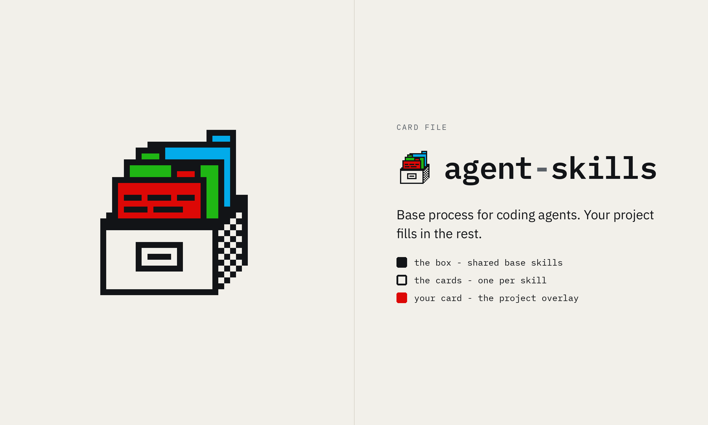
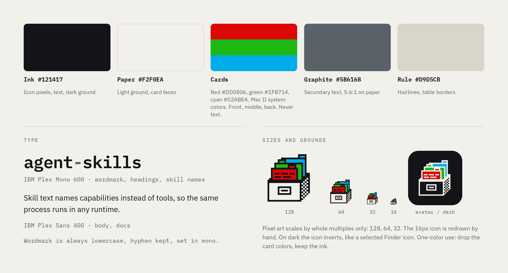

# agent-skills identity

The mark is a card file drawn as a 32 x 32 bitmap in the style of early Macintosh icons.
The box is the shared base skills, each card is one skill, and the red front card is your project's overlay.

## Palette

| Name | Hex | Use |
|---|---|---|
| Ink | `#121417` | Icon pixels, text, dark ground |
| Paper | `#F2F0EA` | Light ground, card faces |
| Red | `#DD0806` | Front card |
| Green | `#1FB714` | Middle card |
| Cyan | `#02ABEA` | Back card |
| Graphite | `#5B6168` | Secondary text |
| Rule | `#D9D5CB` | Hairlines, table borders |

The card colors come from the Macintosh II 16-color system table (`'clut'` resource ID 4).
They fill cards only and are never used for text.

## Type

- Wordmark, headings and skill names: IBM Plex Mono 600.
- Body and docs: IBM Plex Sans 400.
- The wordmark is always lowercase `agent-skills`, with the hyphen kept and set in Graphite.

## Icon files

| File | Use |
|---|---|
| `icon/agent-skills.svg` | Master 32 x 32 bitmap, light ground |
| `icon/agent-skills-dark.svg` | Inverted for dark grounds |
| `icon/agent-skills-16.svg`, `icon/agent-skills-16-dark.svg` | Hand-drawn 16 x 16 version for favicons and small UI |
| `icon/agent-skills-{16,32,64,128,256,512}.png` | Light-ground PNGs |
| `icon/agent-skills-{16,32,64,128,256,512}-dark.png` | Dark-ground PNGs |
| `icon/agent-skills-tile-512.png` | Rounded ink tile for avatars and team icons |

## Rules

- Scale the bitmap by whole multiples only: 32, 64, 128, 256, 512.
  Use the 16 x 16 drawing below 32 px.
- On dark grounds use the inverted version: ink and paper swap, the card colors stay.
- One-color use: drop the card colors and keep the ink.
